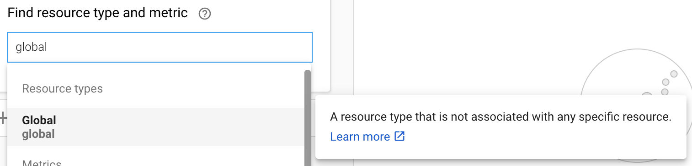
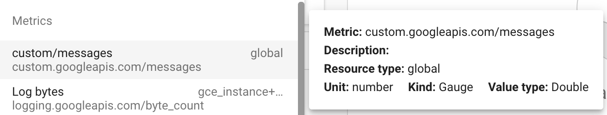

[](https://circleci.com/gh/itzg/stackdriver-spring-boot-autoconfigure)
[](https://jitpack.io/#itzg/stackdriver-spring-boot-autoconfigure)

This module provides a Spring Boot auto-configuration to export actuator metrics to 
Google Cloud's Stackdriver.

# Adding to your project

Follow the instructions [at JitPack](https://jitpack.io/#itzg/stackdriver-spring-boot-autoconfigure).

# Application configuration

The only configuration needed is to set the Spring property
`management.metrics.export.stackdriver.project-id` to reference your GCP project's ID.

# Authentication

If running external to a GCP compute resource, refer to the 
[GCP Monitoring Client documentation](https://cloud.google.com/monitoring/docs/reference/libraries#setting_up_authentication)
and you will need to generate an authentication key file and pass the path to that via the
environment variable `GOOGLE_APPLICATION_CREDENTIALS`.

# Stackdriver resource type and metric naming

You will be able to locate your metrics within the Resource Type "Global", as shown here:



The default Stackdriver naming convention prepends your metric's name with "custom/", as shown here:



The metric shown in the example was declared like the following:

```java
  @Autowired
  public SomeAppService(MeterRegistry meterRegistry) {
    messagesPre = meterRegistry.counter("messages", "stage", "pre");
    messagesPost = meterRegistry.counter("messages", "stage", "post");
  }
```

# Development

## Preparing a release

Use the Maven release plugin to perform the build, tag, and update

```bash
mvn release:prepare
```

With that completed, git push the commits and tag to the repo.